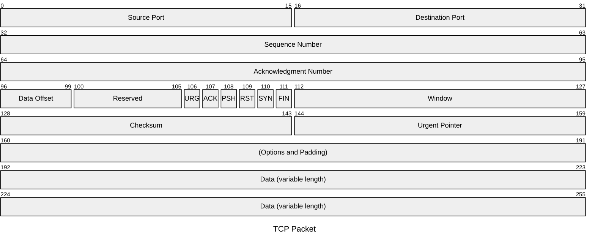
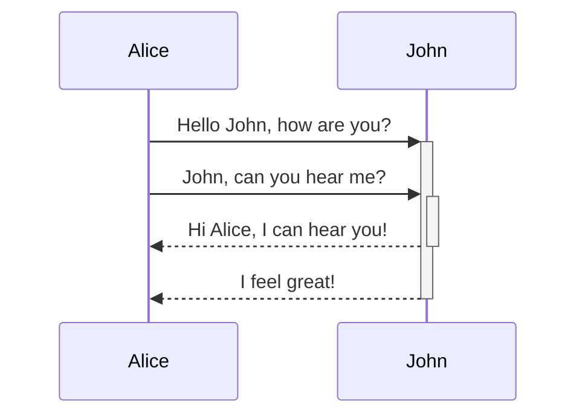

```mermaid
---
title: "TCP Packet"
---
packet-beta
0-15: "Source Port"
16-31: "Destination Port"
32-63: "Sequence Number"
64-95: "Acknowledgment Number"
96-99: "Data Offset"
100-105: "Reserved"
106: "URG"
107: "ACK"
108: "PSH"
109: "RST"
110: "SYN"
111: "FIN"
112-127: "Window"
128-143: "Checksum"
144-159: "Urgent Pointer"
160-191: "(Options and Padding)"
192-255: "Data (variable length)"

```



```mermaid
sequenceDiagram
Alice->>+John: Hello John, how are you? 
Alice->>+John: John, can you hear me? 
John-->>-Alice: Hi Alice, I can hear you! 
John-->>-Alice: I feel great! 
```

### 3-Way Handshake
```bash
# Terminal 1
nc -l  8080
```

```bash
# Terminal 2
curl localhost:8080
```


### 4-Way Handshake
```bash
# Terminal 2 (Keyboard Interrupt (SIGINT))
```


