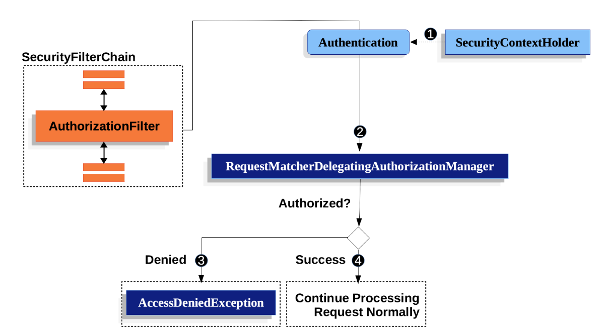
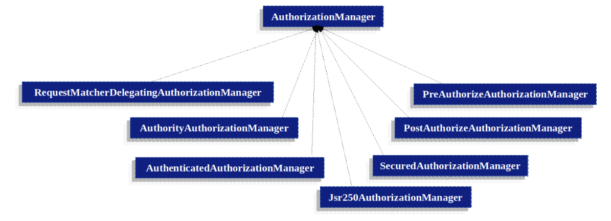

## [SpringSecurity] Authorization 프로세스 분석 및 동작 원리

### AuthorizationFilter 는 뭐하는 놈인가?

`Spring Security` 에서 `FormLogin` 을 사용하면 `UsernamePasswordAuthenticationFilter` 가 로그인 요청에 대해 인증프로세스를 진행하게 된다.

그렇다면 인증된 사용자의 `권한`을 `Spring Security` 는 어떤방식으로 구분하고, `EndPoint` 에 대해 접근제어를 수행할까?

그 정답은 `SecurityFilterChain` 에서 가장 마지막에 위치한 `AuthorizationFilter` 이다. 즉,`FilterSecurityInterceptor` 는 Authorization 관련 프로세스를 진행한다.

*비교적 최신이지만.. 과거에는 `FilterSecurityInterceptor` 였다*

> 해당 포스팅에서는 이러한 인가 프로세스의 흐름을 공식문서를 참고하며 코드레벨에서 분석할 것이다.

### 공식문서에서 말하는 AuthorizationFilter 의 큰 흐름

우선 아래의 사진을 보자. SpringSecurity 는 `AuthorizationFilter` 에서 수행하는 인가프로세스의 흐름을 크게 4가지로 표현하고있는 사진이다.

각 단계들의 의미는 아래와 같다.

1. `SecurityContextHolder` 가 포함하고있는 `SecurityContext` 에서 인증객체인 `Authentication` 객체를 꺼내온다.
   
2. 꺼내온 인증객체인 `Authentication` 객체와 `HttpServletRequest` 객체를 `AuthorizationManager` 인터페이스의 구현체들 중 하나인 `RequestMatcherDelegatingAuthorizationManager` 에게 인가 작업을 위임하게된다.
프로세스가 완료되면 `RequestMatcherDelegatingAuthorizationManager` 는 리턴 값으로 `AuthorizationDecision` 타입의 인가결과를 뱉게 된다.

    > 여기서  `RequestMatcherDelegatingAuthorizationManager` 는 MethodSecurity 방식이 아닌, authorizeHttpRequests 를 사용할떄 쓰이는 `AuthorizationManager` 인터페이스의 구현체중 하나이다.
      또한, `AuthorizationManager` 는 과거의 `AccessDecisionManager` 와 ` AccessDecisionVoter` 가 하나로 통합된 것이다.

3. 인가 결과인 `AuthorizationDecision` 이 Denied 이면 `AuthorizationDeniedEvent` 를 발행하게 되고 `AccessDeniedException` 이 터지게된다. 여기서 터지게되는 `AccessDeniedException` 는
해당 필터를 호출한 이전필터인 `ExceptionTranslationFilter` 가 핸들링하게된다. 

4. 하지만 인가 결과가 Success 이면, `AuthorizationGrantedEvent` 를 발행하고 `doFilter()` 메서드를 통해 다음필터로 이동하게 된다.

> 사실 `AuthorizationFilter` 는 SecurityFilterChain 의 맨 마지막에 위치하기때문에 doFilter 를 통해 다음필터를 호출하게되면, 서블릿컨텍스트에 진입해 `HttpServlet` 이 호출되게 된다.

아래 사진은 SpringSecurity 에서 지원하는 `AuthorizationManager` 들의 구현체들이다. 별다른 의미는 없고 한번 보기만해보자.

### 코드레벨에서 AuthorizationFilter 동작 분석.

