## INTRO

이번 `SOCKET` 문제는 개인적으로 굉장히 열받는 문제였다. 문제에서 요구하는 기술적인 난이도는 쉬운편이었지만,
`Fuzzing` 의 연속이었다. 그중 최악은 `Initial Access` 하기위해 User 이름을 `Enumerate` 해야하는 것이다.
아니, 이건 그냥 예측하는 문제라고 보는게맞는 것 같다.

## Recon

### Port Scan

항상 하던대로 `0~65535` 포트를 스캔해준다.

항상 열려있는 SSH 와 80 포트를 제외하고 5789 에서 돌아가는 `unknown` 서비스가 돌아가고있음을 알 수 있다.

또한 80 포트에서 돌아가는 Web Service 의 도메인이 `http://qreader.htb/` 이다.

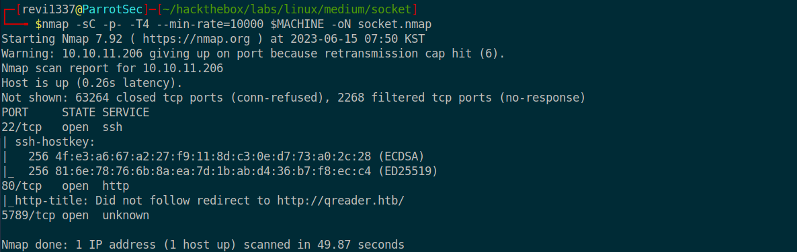
<br><br>

### Information Gathering

우선 80 포트에서 사용중인 Web Service 는 `Python 3/10.6` 환경에서 돌아가고있고, `Flask` 로 만든 것임을 확인할 수 있다.

또한 `Flask` 를 사용중이기 때문에 템플릿 엔진을 이용한 `SSTI` 를 악용할 가능성도 충분히 가능할 것이다.

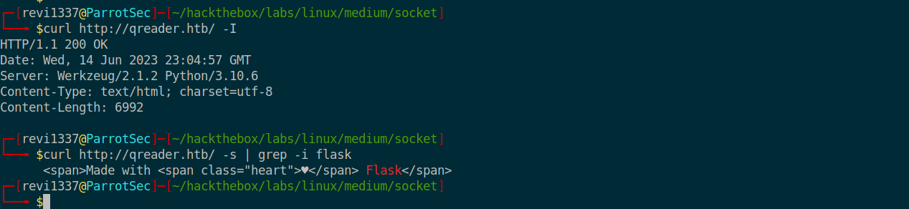
<br><br>

우선 메인페이지를 가면 `QRCode` 를 `PlainText` 로 이루어진 `PNG` 로 변환시켜주는 기능과 그 반대의 역할을 하는 기능을 가진 사이트로 보인다.

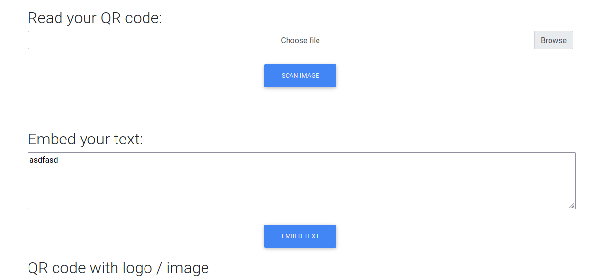
<br><br>

또한, 메인페이지에서 `windows` 와 `linux` 용 Binary 파일을 다운받을수 있는데, 해당파일들은 `Suffix` 가 ZIP 이고 압축을 해제해주면, `qreader` Binary 와 QR 코드인 `test.png` 파일이 나오게된다.

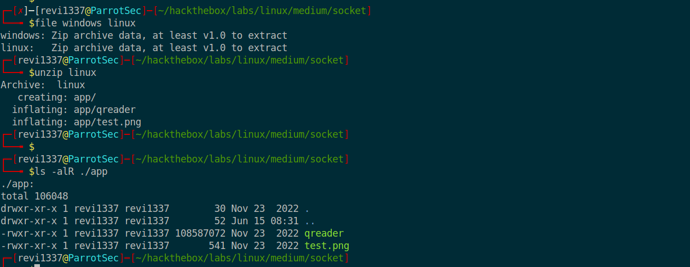
<br><br>

test.png 를 `zbarimg` 도구로 디코딩을 해보면, `QR-Code:kavigihan` 라는 글자가 나오게된다.

`curl` 로 직접 요청을 보내어 QR 코드를 생성하여 디코딩했을때 revi1337 이라는 글자가  나오는 것을 보면, 원격지 서버에는 `kavigihan` 계정의사용자가 존재할것임을 추측해볼 수 있다.

(결국엔 아무 관련이없었다. 진짜 그냥 Test 파일이었을 뿐...)

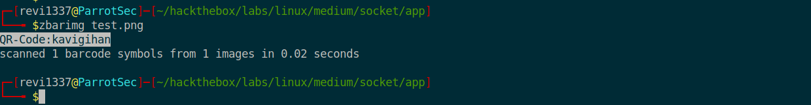
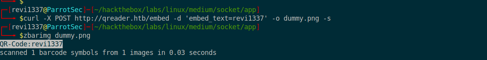
<br><br>

`SSTI` 를 테스트하고 있던 도중 특이한점을 발견했는데, 웹에서 `QRCode` 를 생성하거나 `PNG` 로 변환하는 작업을하면, 아래의 `Total Convertions` 을 횟수가 변한다는 것이다.

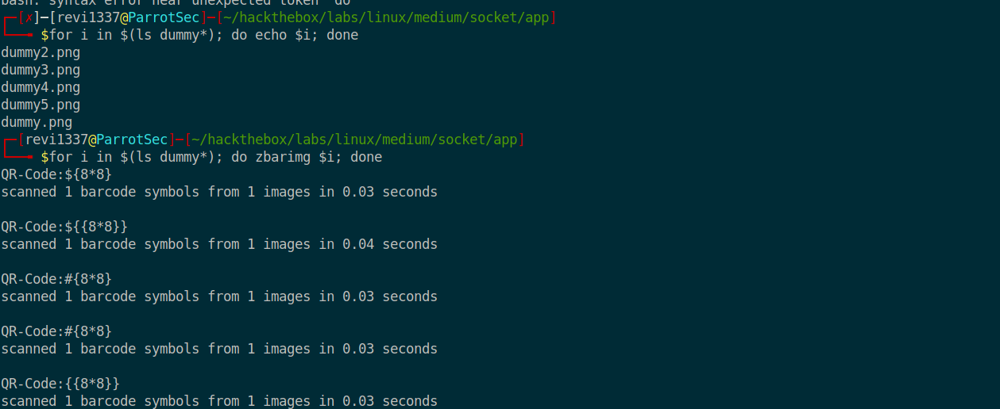
<br><br>

`Burp` 에서 보았을때는 Total Convertions 와 관련된 파라미터를 볼 수 없었기 때문에, 문제의 제목인 `Socket` 과 `nmap` 에서 얻은 Unknown 서비스를 사용하고 있을 수도 있다 추측할 수 있다.


<br><br>

이제 직접 `5789` 포트에 연결해보면 `Python websocket` 을 사용중임을 확인할 수 있다.

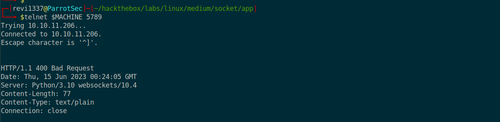
<br>

### Connecting WebSocket

아래 `Python` 코드는 `WebSocket` 통신하는 스크립트를 간단하게 작성한 것이다. 특별한 것은 없고,
websocket 에 연결해서 `json` 만 보내주는 스크립트이다.

```python
import asyncio
import websockets
import json

async def test():
    async with websockets.connect('ws://10.10.11.206:5789') as websocket:
        payload = {"dummy": "dummy"}
        data = str(json.dumps(payload))
        await websocket.send(data)
        response = await websocket.recv()
        print(response)
        
asyncio.get_event_loop().run_until_complete(test())
```
<br>

작성한 스크립트로 `ws://10.10.11.206:5789` 에 연결해보면 `json` 으로 오류메시지가 출력되게 된다.

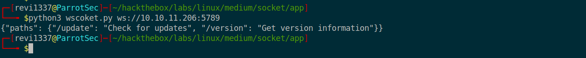
<br><br>

발생한 오류를 토대로 따라가서 `ws://10.10.11.206:5789/update` 에 요청을 보내면 다운받을 수 있는 버전 정보가 나오게 된다.

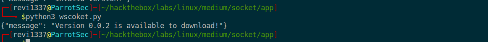
<br><br>

### SQL Injection (SQLite3)

이번에는`ws://10.10.11.206:5789/version` 경로에 요청을 보내는데, /update 경로에서 얻은 버전을 명시하여 보내보면 `{"version": "0.0.2"}`
버전 정보와 일치하는 무엇인가가 조회된다. 여기서 `SQLI` 인것을 눈치채야 한다.

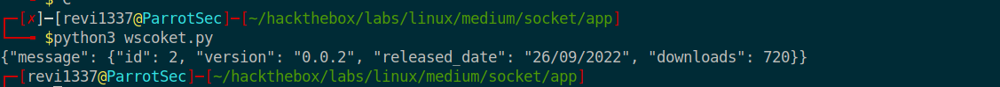
<br><br>

자 이제 `SQLI` 를 하면된다. /version 에 조회했을때 출력된, `json` 의 key 개수만큼 `UNION` 의 select 절에 `null` 을 넣어준다음. 동일한 
`ws://10.10.11.206:5789/version` 경로에 `{"version": "0.0.2\" union all select null, null, null, null --"}` 를 명시하여 요청을 보내주면
성공적으로 인젝션이 성공함을 볼 수 있다.

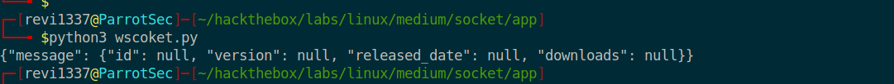
<br><br>

`SQLMAP` 쓸까말까 고민하다가 재밌기도해서 수동진단으로 한다. 일단, 우선 해당 DB 가 어떤 DB 를 사용하지 모르기 때문에
version 정보를 얻는 함수들을 모조리 입력해본다. 결과적으로는 `sqlite_version()` 를 입력했을떄 버전정보가 출력되는데
이는 해당 DB 는 `SQLite3` 를 사용한다는 의미이다.

`{"version": "0.0.2\" union all select sqlite_version(), null, null, null --"}`

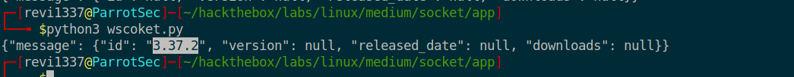
<br><br>

`tbl_name` 으로 현재 DB 에 존재하는 테이블을 얻어와준다. (user, reports 테이블 을 포함해 3개인가 있었고, 그 중 당연히 user 테이블을 집중적으로 보았다.)

`{"version": "0.0.2\" union all select null, tbl_name, null, null from sqlite_master limit 3,1 --"}`
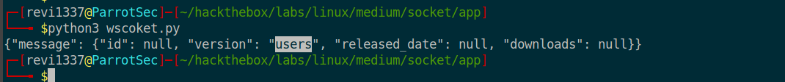
<br><br>

이제 `sql` 로 해당 table 이 만들어지게 된 `DDL` 쿼리를 봐서 어떤 `COLUMN` 이 존재하는지 확인해준다.

`{"version": "0.0.2\" union all select null, sql, null, null from sqlite_master limit 3,1 --"}`
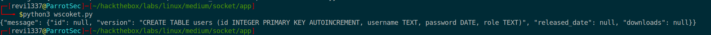
<br><br>

이제 `COLUMN` 을 확인했으면 `Users` 테이블에있는 계정정보를 얻어준다.

`{"version": "0.0.2\" union all select null, username, password, null from users limit 2,1 --"}`

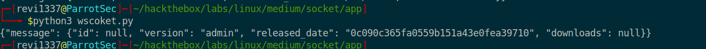
<br><br>

얻은 계정정보를 `CrackStation` 에 크랙을 맡겨주면 `denjanjade122566` 패스워드임을 확인할 수 있다.

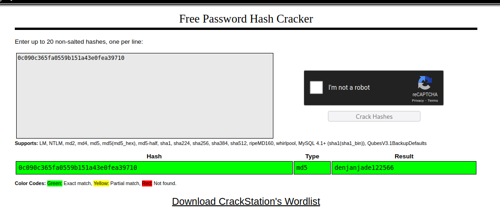
<br><br>

이렇게 얻은 `admin:denjanjade122566` 계정정보를 ssh 에 로그인하면 될줄알았는데, 되지않았다.
여기서 시간 겁나많이 잡아먹었는데, 답이안나와 포럼을 보니까, `user` 테이블에서 계정정보를 얻는게 아니라고한다.
결론은 `reports` 테이블에 있는 있는 글에 나온 이름이라고한다. ~~문제진짜 드럽다~~  
여기서 또 겁나웃긴건 `ssh` 에 입력할떄 username 도 `tkeller` 라는 것이다. 

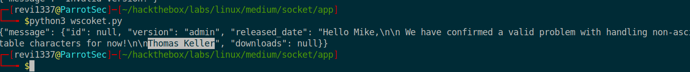
<br><br>

### Initial Access

여튼 `tkeller` 계정으로 ssh 에 로그인해주고, `sudo -l` 으로 sudo 로 어떤커맨드를 사용할수있는지 확인해보면,
sudo 로 passwd 없이`build-installer.sh` 를 실행할 수 있다고 나와있다. 

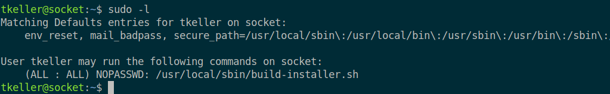
<br><br>

### Privilege Escalation

자 아래는 `build-installer.sh` 의 내용이다. 사진에 주석을 명시해주었지만, 간단하게 요약하자면 
CommandLine 에서 매개변수를 받는데, (Ex. `./executable argv[1] argv[2]`)
`argv[1]` 는 build, make, cleanup 셋중 하나여야하고, `argv[2]` 는 Suffix 가 .spec 혹은 .py 로 끝나야한다.

취약점이 발생하는 부분은 build 를 사용했을때다. `argv[2]` 로 `exploit.spec` 가 왔다고 가정하면
`awk -F .` 로 확장자 필터링이 되지만, 결국엔 `exploit` 이라는 파일이 pyinstaller 로인해 실행되게 된다.
`Pyinstaller` 는 파이썬파일을 exeutable 하게 만들어주는명령어가 sudo 로 사용하게되면
루트권한으로 특정 커맨드를 실행할 수 있단는 얘기가된다.

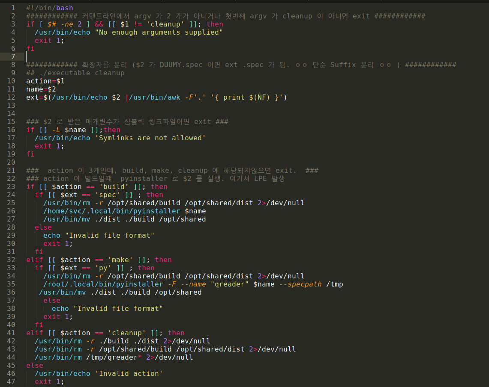
<br><br>

따라서 간단하게 exploit 코드를 작성해주고 sudo 로 스크립트를 실행해주면 Root 쉘을 따낼 수 있다.

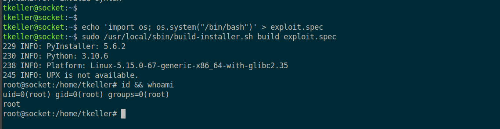
<br><br>


<br><br>


